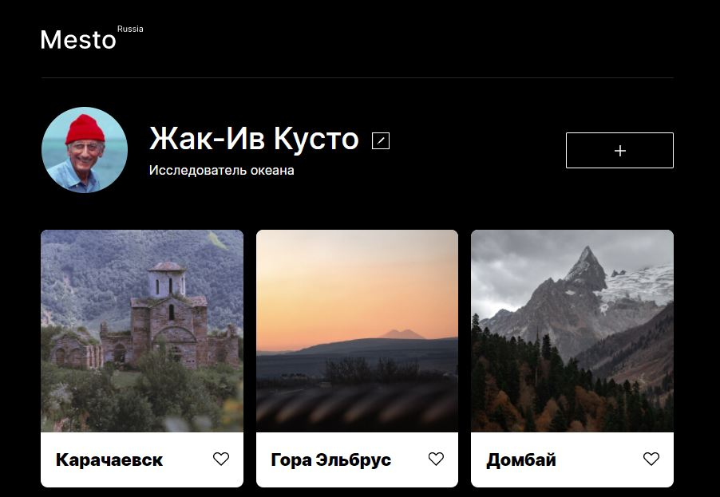

# Проектная работа: «Место»

## Описание

Проектная работа подготовлена в рамках четвёртого спринта курса [Яндекс.Практикум](https://practicum.yandex.ru/) факультета [«Веб-разработчик».](https://practicum.yandex.ru/web/). В работе применены расширенные возможности HTML и CSS, JavaScript (работа с DOM), git.

## Технологии
* Grid Layout
* Flexbox
* Media queries
* Позиционирование элементов
* БЭМ-методология
* Файловая структура БЭМ Nested
* Figma
* JavaScript (DOM)

## Ссылка на проект
[Github Pages](https://mashafromrasha.github.io/mesto/)

## Чеклист
[Чеклист проектной работы](https://code.s3.yandex.net/web-developer/checklists-pdf/new-program/checklist-4.pdf)

## Демо
